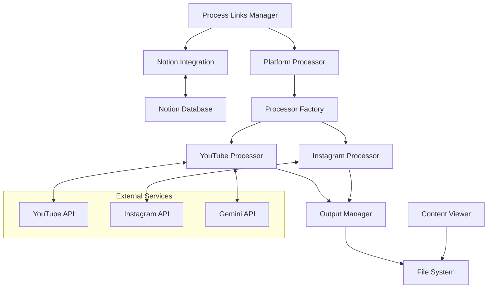

# Process Saved Links: Architecture

## System Architecture Diagram

## Component Breakdown

### 1. Core Processing Components

#### 1.1 Process Links Manager
- **Purpose**: Main orchestration script that controls the processing workflow
- **Features**:
  - Command-line interface
  - Parallel processing management
  - Platform-specific batch processing
  - Continuous processing mode

#### 1.2 Platform Processor
- **Purpose**: Handles platform-specific processing with appropriate rate limiting and batch sizes
- **Features**:
  - Platform-specific configuration
  - Batch processing
  - Rate limiting
  - Error handling

#### 1.3 Processor Factory
- **Purpose**: Creates the appropriate processor based on the URL type
- **Features**:
  - URL pattern recognition
  - Processor instantiation
  - Extensible design for new platforms

#### 1.4 Platform-specific Processors
- **Purpose**: Handle the actual content download and processing for each platform
- **Types**:
  - Base Processor: Abstract class defining the interface
  - YouTube Processor: YouTube-specific implementation
  - Instagram Processor: Instagram-specific implementation
- **Features**:
  - Content downloading
  - Transcript generation
  - Metadata extraction
  - Thumbnail creation

### 2. Integration Components

#### 2.1 Notion Integration
- **Purpose**: Manages the interaction with the Notion database
- **Features**:
  - Retrieve unprocessed links
  - Update processing status
  - Store metadata

#### 2.2 Output Manager
- **Purpose**: Handles standardized file output
- **Features**:
  - File path generation
  - Metadata formatting
  - Transcript formatting

### 3. User Interface Components

#### 3.1 Content Viewer
- **Purpose**: Web-based interface for viewing processed content
- **Features**:
  - Content browsing
  - Video playback
  - Transcript viewing
  - Metadata display

## Data Flow

### Processing Workflow

1. **Initialization**:
   - Process Links Manager starts
   - Command-line arguments are parsed
   - Parallel mode and platform selection are configured

2. **Link Retrieval**:
   - Notion Integration fetches unprocessed links from Notion
   - Links are filtered by platform if a specific platform is selected

3. **Processing**:
   - For each platform enabled:
     - Platform Processor initializes with platform-specific settings
     - Processor Factory creates appropriate processor for each link
     - Content is downloaded, processed, and saved
     - Notion status is updated

4. **Output Generation**:
   - Standardized files are saved:
     - Video/image files
     - Thumbnails
     - Transcripts
     - Metadata

5. **Continuous Operation** (if enabled):
   - Process repeats with configured delays
   - Continues until stopped or no more links are found

### Content Viewing

1. **Server Startup**:
   - FastAPI server initializes
   - File system is scanned for processed content

2. **Content Display**:
   - User accesses web interface
   - Content is displayed in organized format
   - Videos can be played in-browser
   - Transcripts and metadata are accessible

## Integration Points

### External Service Integration

1. **Notion API**:
   - Database for tracking links and status
   - REST API for querying and updating

2. **YouTube**:
   - Content source via yt-dlp
   - Video, thumbnail, and metadata extraction

3. **Instagram**:
   - Content source via Instaloader
   - Images, videos, stories, and caption extraction

4. **Gemini API**:
   - AI assistance for transcript generation
   - Processing audio content to text

## Scalability Considerations

1. **Horizontal Scalability**:
   - Each platform processor can run independently
   - Parallel processing across platforms

2. **Rate Limiting**:
   - Configurable batch sizes for each platform
   - Delays between batches to respect API limits

3. **Resource Management**:
   - Disk space monitoring for downloaded content
   - Cleanup utilities for managing storage

## Future Extensibility

The architecture is designed for extensibility in these areas:

1. **Additional Platforms**:
   - Create new processor classes implementing BaseProcessor
   - Register in Processor Factory
   - Configure in platform_config.py

2. **Enhanced Viewing**:
   - Expand FastAPI server capabilities
   - Add search and filtering
   - Implement mobile-friendly viewing

3. **Advanced Processing**:
   - Content categorization
   - AI-based summarization
   - Tagging and organization
